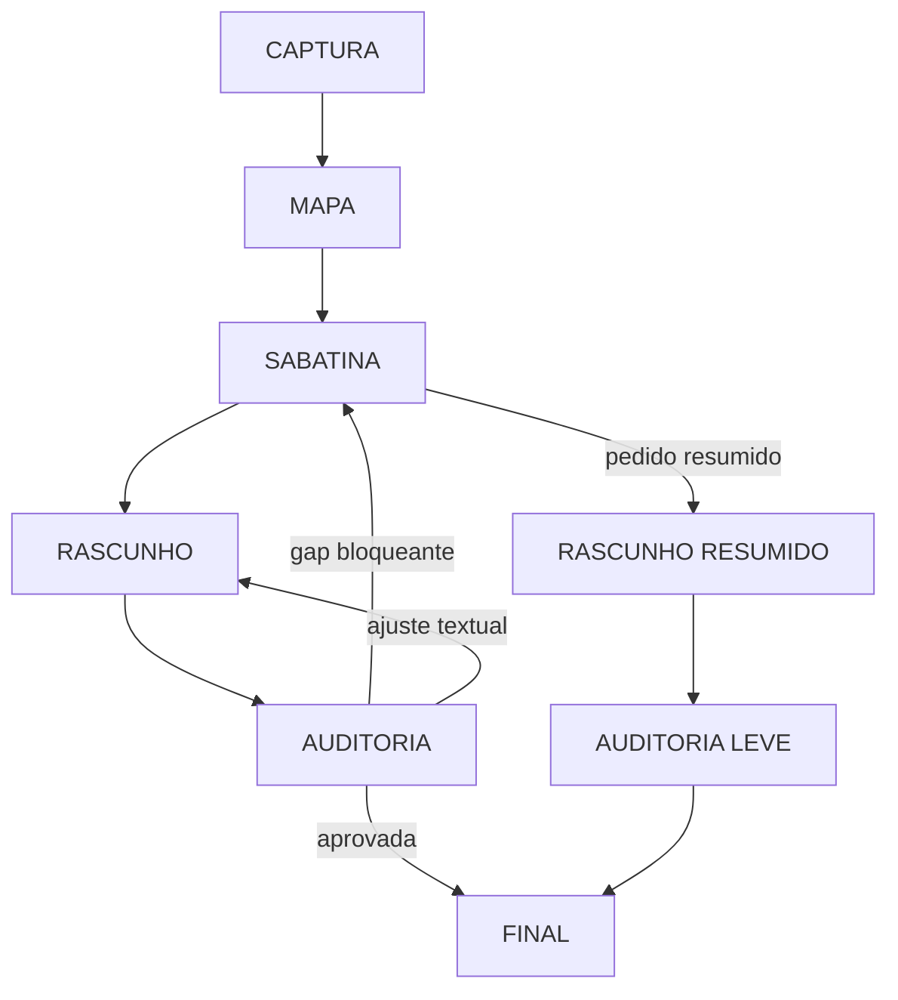

# Arquitetura

## Adaptação do projeto original

| Mecânica original | Implementação BeeStock |
|---|---|
| Router de fluxo | `criar-especificacao` e aliases explícitos |
| `grill-with-docs` | CAPTURA, MAPA e SABATINA com ledger de decisões |
| `grilling` | Árvore de decisões, fronteira e rodadas com recomendação |
| `CONTEXT.md` | ENTENDIMENTO e vocabulário confirmado do caso |
| ADRs | DECISOES com justificativa e impacto, somente durante a demanda |
| `to-spec` | RASCUNHO no modelo Jira BeeStock |
| `code-review` em dois eixos | Completude funcional + Clareza/padrão Jira |
| Phase boundaries | Continuidade no contexto e `HANDOFF.md` ao trocar de harness |
| TDD | Cenários observáveis e testes de contrato da própria skill |
| Implementação | Removida; o fluxo termina na especificação aprovada |

## Estado da demanda

## Divulgação progressiva

`SKILL.md` contém somente invariantes, roteamento e critérios de passagem. O agente carrega recursos conforme a fase:

- `evidence-and-state.md`: fontes, ledger e continuidade.
- `interview.md`: árvore, fronteira e rodadas.
- `jira-format.md`: contrato de saída.
- `audit-rubric.md`: gate completo ou leve.
- `learning-loop.md`: evolução controlada.
- `examples/`: apenas o exemplo aplicável.

## Fonte única e aliases

`skill-src/criar-especificacao` é a única fonte editável. `scripts/build_skills.py` gera bundles autocontidos para `criar-especificacao`, `criar` e `jira`. A duplicação em `skills/` é um artefato de distribuição validado, necessário porque os harnesses descobrem cada comando como um bundle direto e nem todos resolvem aliases ou referências entre skills da mesma forma.

## Limites de decisão

O Product Owner decide comportamento e escopo. A skill busca fatos nas evidências e pode recomendar boas práticas. O desenvolvimento decide a implementação interna. Essa separação é aplicada tanto nas perguntas quanto na redação e na auditoria.
